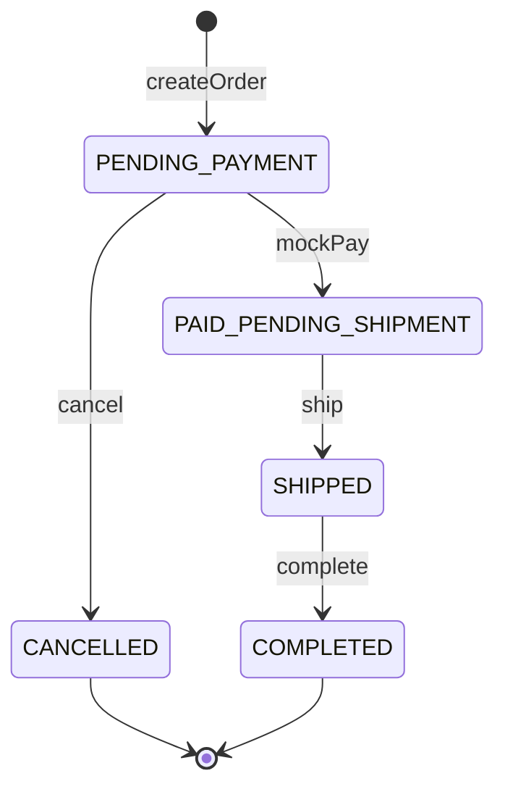

# 小电商平台 MVP 详细设计

## 1. 文档信息

| 字段 | 内容 |
| --- | --- |
| 产品名称 | KKMall 小电商平台 |
| 文档类型 | 详细设计 |
| 版本 | v0.1 |
| 日期 | 2026-04-29 |
| 依据文档 | `docs/prd.md`, `docs/overview-design.md` |

## 2. 技术实现基准

如无额外约束，MVP 默认使用：

- 前端：React + TypeScript + Vite。
- 后端：Spring Boot 3。
- 数据库：MySQL 8。
- 鉴权：JWT。
- 金额：数据库使用整数分，接口展示可返回分和格式化金额。

目录建议：

```text
kkmall/
  frontend/
    src/
      pages/
      components/
      services/
      stores/
      types/
  backend/
    src/main/java/com/kkmall/
      auth/
      catalog/
      cart/
      order/
      payment/
      fulfillment/
      admin/
      common/
```

## 3. 数据库详细设计

### 3.1 通用字段

除特殊说明外，业务表统一包含：

- `id`：BIGINT 主键。
- `created_at`：创建时间。
- `updated_at`：更新时间。
- `deleted`：逻辑删除，0 未删除，1 已删除。

金额字段统一以分为单位，类型使用 `BIGINT`。

### 3.2 users

```sql
CREATE TABLE users (
  id BIGINT PRIMARY KEY AUTO_INCREMENT,
  phone VARCHAR(20) NOT NULL,
  nickname VARCHAR(64) NOT NULL,
  role VARCHAR(20) NOT NULL DEFAULT 'CUSTOMER',
  created_at DATETIME NOT NULL,
  updated_at DATETIME NOT NULL,
  deleted TINYINT NOT NULL DEFAULT 0,
  UNIQUE KEY uk_users_phone (phone),
  KEY idx_users_role (role)
);
```

约束：

- `role` 取值：`CUSTOMER`, `ADMIN`。
- 手机号为用户端唯一登录标识。
- 后台管理员 MVP 可通过种子数据初始化。

### 3.3 addresses

```sql
CREATE TABLE addresses (
  id BIGINT PRIMARY KEY AUTO_INCREMENT,
  user_id BIGINT NOT NULL,
  receiver_name VARCHAR(64) NOT NULL,
  receiver_phone VARCHAR(20) NOT NULL,
  region VARCHAR(128) NOT NULL,
  detail VARCHAR(255) NOT NULL,
  is_default TINYINT NOT NULL DEFAULT 0,
  created_at DATETIME NOT NULL,
  updated_at DATETIME NOT NULL,
  deleted TINYINT NOT NULL DEFAULT 0,
  KEY idx_addresses_user_id (user_id)
);
```

约束：

- 用户只能操作自己的地址。
- MVP 不强制做省市区编码表，`region` 使用文本。

### 3.4 categories

```sql
CREATE TABLE categories (
  id BIGINT PRIMARY KEY AUTO_INCREMENT,
  name VARCHAR(64) NOT NULL,
  sort_order INT NOT NULL DEFAULT 0,
  enabled TINYINT NOT NULL DEFAULT 1,
  created_at DATETIME NOT NULL,
  updated_at DATETIME NOT NULL,
  deleted TINYINT NOT NULL DEFAULT 0,
  KEY idx_categories_enabled_sort (enabled, sort_order)
);
```

### 3.5 products

```sql
CREATE TABLE products (
  id BIGINT PRIMARY KEY AUTO_INCREMENT,
  category_id BIGINT NOT NULL,
  title VARCHAR(128) NOT NULL,
  description TEXT NULL,
  images JSON NULL,
  status VARCHAR(20) NOT NULL DEFAULT 'DRAFT',
  created_at DATETIME NOT NULL,
  updated_at DATETIME NOT NULL,
  deleted TINYINT NOT NULL DEFAULT 0,
  KEY idx_products_category_status (category_id, status),
  KEY idx_products_status_created (status, created_at)
);
```

约束：

- `status` 取值：`DRAFT`, `ON_SALE`, `OFF_SALE`。
- 用户端只查询 `ON_SALE` 商品。
- `images` 存储图片 URL 数组。

### 3.6 skus

```sql
CREATE TABLE skus (
  id BIGINT PRIMARY KEY AUTO_INCREMENT,
  product_id BIGINT NOT NULL,
  spec_name VARCHAR(64) NOT NULL,
  spec_value VARCHAR(64) NOT NULL,
  price BIGINT NOT NULL,
  stock INT NOT NULL,
  created_at DATETIME NOT NULL,
  updated_at DATETIME NOT NULL,
  deleted TINYINT NOT NULL DEFAULT 0,
  KEY idx_skus_product_id (product_id)
);
```

约束：

- `price >= 0`。
- `stock >= 0`。
- MVP 支持单维规格。如果后续需要颜色 + 尺码组合，可将 `spec_name/spec_value` 扩展为 JSON。

### 3.7 cart_items

```sql
CREATE TABLE cart_items (
  id BIGINT PRIMARY KEY AUTO_INCREMENT,
  user_id BIGINT NOT NULL,
  product_id BIGINT NOT NULL,
  sku_id BIGINT NOT NULL,
  quantity INT NOT NULL,
  created_at DATETIME NOT NULL,
  updated_at DATETIME NOT NULL,
  deleted TINYINT NOT NULL DEFAULT 0,
  UNIQUE KEY uk_cart_user_sku (user_id, sku_id, deleted),
  KEY idx_cart_user_id (user_id)
);
```

约束：

- `quantity >= 1`。
- 相同用户、相同 SKU 只保留一条未删除购物车项。

### 3.8 orders

```sql
CREATE TABLE orders (
  id BIGINT PRIMARY KEY AUTO_INCREMENT,
  order_no VARCHAR(32) NOT NULL,
  user_id BIGINT NOT NULL,
  product_amount BIGINT NOT NULL,
  shipping_fee BIGINT NOT NULL,
  payable_amount BIGINT NOT NULL,
  status VARCHAR(32) NOT NULL,
  address_snapshot JSON NOT NULL,
  paid_at DATETIME NULL,
  shipped_at DATETIME NULL,
  completed_at DATETIME NULL,
  cancelled_at DATETIME NULL,
  created_at DATETIME NOT NULL,
  updated_at DATETIME NOT NULL,
  deleted TINYINT NOT NULL DEFAULT 0,
  UNIQUE KEY uk_orders_order_no (order_no),
  KEY idx_orders_user_created (user_id, created_at),
  KEY idx_orders_status_created (status, created_at)
);
```

约束：

- `status` 取值见第 5 节。
- `address_snapshot` 保存下单时地址文本，不依赖地址表后续变化。

### 3.9 order_items

```sql
CREATE TABLE order_items (
  id BIGINT PRIMARY KEY AUTO_INCREMENT,
  order_id BIGINT NOT NULL,
  product_id BIGINT NOT NULL,
  sku_id BIGINT NOT NULL,
  title_snapshot VARCHAR(128) NOT NULL,
  image_snapshot VARCHAR(512) NULL,
  sku_snapshot VARCHAR(128) NOT NULL,
  unit_price BIGINT NOT NULL,
  quantity INT NOT NULL,
  subtotal BIGINT NOT NULL,
  created_at DATETIME NOT NULL,
  updated_at DATETIME NOT NULL,
  deleted TINYINT NOT NULL DEFAULT 0,
  KEY idx_order_items_order_id (order_id),
  KEY idx_order_items_sku_id (sku_id)
);
```

### 3.10 shipments

```sql
CREATE TABLE shipments (
  id BIGINT PRIMARY KEY AUTO_INCREMENT,
  order_id BIGINT NOT NULL,
  logistics_company VARCHAR(64) NOT NULL,
  tracking_no VARCHAR(64) NOT NULL,
  shipped_at DATETIME NOT NULL,
  created_at DATETIME NOT NULL,
  updated_at DATETIME NOT NULL,
  deleted TINYINT NOT NULL DEFAULT 0,
  UNIQUE KEY uk_shipments_order_id (order_id)
);
```

约束：

- MVP 一个订单只允许一条发货记录。
- 不保存物流轨迹，只保存物流公司和单号。

## 4. 枚举与状态

### 4.1 用户角色

| 枚举 | 说明 |
| --- | --- |
| `CUSTOMER` | 普通消费者 |
| `ADMIN` | 后台管理员 |

### 4.2 商品状态

| 枚举 | 说明 |
| --- | --- |
| `DRAFT` | 草稿，后台可见，用户不可见 |
| `ON_SALE` | 上架，用户可见可购买 |
| `OFF_SALE` | 下架，后台可见，用户不可见 |

### 4.3 订单状态

| 枚举 | 说明 |
| --- | --- |
| `PENDING_PAYMENT` | 待支付 |
| `PAID_PENDING_SHIPMENT` | 已支付/待发货 |
| `SHIPPED` | 已发货 |
| `COMPLETED` | 已完成 |
| `CANCELLED` | 已取消 |

状态流转：



MVP 不包含 `PAYING`、`REFUNDING`、`AFTER_SALE` 等状态。

## 5. 后端服务详细设计

### 5.1 AuthService

#### sendMockCode(phone)

输入：

- `phone`

处理：

1. 校验手机号格式。
2. 开发环境返回模拟发送成功。
3. 模拟验证码固定为 `123456`。

输出：

- `mockCodeSent = true`

#### loginByPhone(phone, code)

处理：

1. 校验手机号格式。
2. 校验验证码等于 `123456`。
3. 按手机号查询用户。
4. 不存在则创建用户，默认角色 `CUSTOMER`。
5. 生成 JWT。
6. 返回 token 和用户信息。

异常：

- `AUTH_INVALID_PHONE`
- `AUTH_INVALID_CODE`

### 5.2 CatalogService

#### listCategories()

- 用户端只返回 `enabled = 1` 且未删除分类。
- 按 `sort_order ASC, id ASC` 排序。

#### listProducts(categoryId, keyword, page, pageSize)

处理：

1. 只查询 `status = ON_SALE` 商品。
2. 如果传入分类，则按分类过滤。
3. 如果传入关键词，则按标题模糊搜索。
4. 返回商品基础信息和最低 SKU 价格。

#### getProductDetail(productId)

处理：

1. 查询商品。
2. 用户端要求商品为 `ON_SALE`。
3. 查询未删除 SKU。
4. 返回商品详情、图片、SKU 列表。

### 5.3 CartService

#### addItem(userId, skuId, quantity)

处理：

1. 校验用户登录。
2. 查询 SKU 和商品。
3. 商品必须 `ON_SALE`。
4. SKU 库存必须大于 0。
5. 如果购物车已有该 SKU，则数量累加。
6. 累加后数量不能超过库存。
7. 保存购物车项。

#### updateQuantity(userId, cartItemId, quantity)

处理：

1. 查询购物车项并校验归属。
2. `quantity >= 1`。
3. 查询 SKU 库存。
4. 数量不能超过库存。
5. 更新数量。

#### listCart(userId)

处理：

1. 查询用户购物车项。
2. 关联商品和 SKU 实时数据。
3. 标记每项是否可结算。
4. 计算可结算商品金额。

不可结算条件：

- 商品不存在。
- 商品未上架。
- SKU 不存在。
- SKU 库存小于购物车数量。

### 5.4 OrderService

#### createOrder(userId, request)

请求字段：

- `cartItemIds`
- `addressId`

处理：

1. 校验用户登录。
2. 查询地址并校验属于当前用户。
3. 查询购物车项并校验均属于当前用户。
4. 查询商品和 SKU 实时数据。
5. 校验商品上架、SKU 存在、库存充足。
6. 计算商品金额：`sum(sku.price * quantity)`。
7. 计算运费：满 9900 分包邮，否则 1000 分。
8. 生成订单号。
9. 创建订单主表，状态为 `PENDING_PAYMENT`。
10. 创建订单明细快照。
11. 删除或逻辑删除已结算购物车项。
12. 返回订单信息。

事务边界：

- 步骤 8-11 必须在同一数据库事务内。
- 创建订单阶段不扣库存。

#### getUserOrders(userId, status, page, pageSize)

- 只能查询当前用户订单。
- 可按状态筛选。
- 按创建时间倒序。

#### getUserOrderDetail(userId, orderId)

- 查询订单并校验 `order.user_id = userId`。
- 返回订单、明细和发货信息。

### 5.5 MockPaymentService

#### mockPay(userId, orderId)

处理：

1. 查询订单并校验属于当前用户。
2. 如果订单已是 `PAID_PENDING_SHIPMENT`、`SHIPPED` 或 `COMPLETED`，直接返回支付成功，不能重复扣库存。
3. 如果订单不是 `PENDING_PAYMENT`，返回状态不允许支付。
4. 查询订单明细对应 SKU。
5. 校验库存充足。
6. 对每个 SKU 执行原子扣减：`stock = stock - quantity`，条件为 `stock >= quantity`。
7. 任一 SKU 扣减失败则回滚事务。
8. 更新订单状态为 `PAID_PENDING_SHIPMENT`，写入 `paid_at`。
9. 返回支付成功。

事务边界：

- 库存扣减和订单状态更新必须在同一事务内。

并发控制：

- 推荐使用条件更新扣库存：

```sql
UPDATE skus
SET stock = stock - ?
WHERE id = ? AND stock >= ? AND deleted = 0;
```

如果影响行数不是 1，则视为库存不足。

### 5.6 FulfillmentService

#### shipOrder(adminUserId, orderId, request)

请求字段：

- `logisticsCompany`
- `trackingNo`

处理：

1. 校验当前用户为 `ADMIN`。
2. 查询订单。
3. 订单状态必须为 `PAID_PENDING_SHIPMENT`。
4. 校验物流公司和物流单号非空。
5. 创建 `shipments` 记录。
6. 更新订单状态为 `SHIPPED`，写入 `shipped_at`。
7. 返回发货信息。

事务边界：

- 创建发货记录和更新订单状态在同一事务内。

## 6. API 详细设计

### 6.1 通用响应

成功：

```json
{
  "code": 0,
  "message": "success",
  "data": {}
}
```

失败：

```json
{
  "code": "ORDER_STATUS_INVALID",
  "message": "当前订单状态不允许该操作",
  "data": null
}
```

### 6.2 鉴权

请求头：

```http
Authorization: Bearer <token>
```

需要登录的用户端接口：

- `/api/v1/cart/**`
- `/api/v1/addresses/**`
- `/api/v1/orders/**`
- `/api/v1/payments/**`

需要管理员角色的接口：

- `/api/v1/admin/**`

### 6.3 用户认证接口

#### POST /api/v1/auth/mock-code

请求：

```json
{
  "phone": "13800138000"
}
```

响应：

```json
{
  "mockCodeSent": true
}
```

#### POST /api/v1/auth/login

请求：

```json
{
  "phone": "13800138000",
  "code": "123456"
}
```

响应：

```json
{
  "token": "jwt-token",
  "user": {
    "id": 1,
    "phone": "13800138000",
    "nickname": "用户1380",
    "role": "CUSTOMER"
  }
}
```

### 6.4 商品接口

#### GET /api/v1/products

查询参数：

- `categoryId`
- `keyword`
- `page`
- `pageSize`

响应：

```json
{
  "items": [
    {
      "id": 1,
      "title": "基础款 T 恤",
      "coverImage": "/images/tshirt.jpg",
      "minPrice": 9900,
      "status": "ON_SALE"
    }
  ],
  "total": 1,
  "page": 1,
  "pageSize": 20
}
```

#### GET /api/v1/products/{id}

响应：

```json
{
  "id": 1,
  "title": "基础款 T 恤",
  "description": "舒适棉质",
  "images": ["/images/tshirt.jpg"],
  "categoryId": 1,
  "skus": [
    {
      "id": 101,
      "specName": "颜色",
      "specValue": "白色",
      "price": 9900,
      "stock": 20
    }
  ]
}
```

### 6.5 购物车接口

#### POST /api/v1/cart/items

请求：

```json
{
  "skuId": 101,
  "quantity": 2
}
```

响应：

```json
{
  "id": 1001,
  "skuId": 101,
  "quantity": 2
}
```

#### GET /api/v1/cart

响应：

```json
{
  "items": [
    {
      "id": 1001,
      "productId": 1,
      "skuId": 101,
      "title": "基础款 T 恤",
      "image": "/images/tshirt.jpg",
      "specText": "颜色：白色",
      "price": 9900,
      "quantity": 2,
      "subtotal": 19800,
      "settleable": true,
      "unsettleableReason": null
    }
  ],
  "productAmount": 19800
}
```

### 6.6 地址接口

#### POST /api/v1/addresses

请求：

```json
{
  "receiverName": "张三",
  "receiverPhone": "13800138000",
  "region": "上海市 浦东新区",
  "detail": "世纪大道 1 号",
  "isDefault": true
}
```

### 6.7 订单接口

#### POST /api/v1/orders

请求：

```json
{
  "cartItemIds": [1001],
  "addressId": 2001
}
```

响应：

```json
{
  "id": 3001,
  "orderNo": "202604291530001234",
  "status": "PENDING_PAYMENT",
  "productAmount": 19800,
  "shippingFee": 0,
  "payableAmount": 19800
}
```

#### GET /api/v1/orders/{id}

响应包含：

- 订单基础信息。
- 订单商品明细。
- 地址快照。
- 发货信息，可为空。

### 6.8 模拟支付接口

#### POST /api/v1/payments/mock

请求：

```json
{
  "orderId": 3001
}
```

响应：

```json
{
  "orderId": 3001,
  "status": "PAID_PENDING_SHIPMENT",
  "paidAt": "2026-04-29T15:35:00"
}
```

### 6.9 后台发货接口

#### POST /api/v1/admin/orders/{id}/shipment

请求：

```json
{
  "logisticsCompany": "顺丰速运",
  "trackingNo": "SF1234567890"
}
```

响应：

```json
{
  "orderId": 3001,
  "status": "SHIPPED",
  "shipment": {
    "logisticsCompany": "顺丰速运",
    "trackingNo": "SF1234567890",
    "shippedAt": "2026-04-29T16:00:00"
  }
}
```

## 7. 错误码

| 错误码 | HTTP | 说明 |
| --- | --- | --- |
| `AUTH_REQUIRED` | 401 | 未登录 |
| `AUTH_FORBIDDEN` | 403 | 无权限 |
| `AUTH_INVALID_PHONE` | 400 | 手机号格式错误 |
| `AUTH_INVALID_CODE` | 400 | 验证码错误 |
| `PRODUCT_NOT_FOUND` | 404 | 商品不存在 |
| `PRODUCT_OFF_SALE` | 400 | 商品未上架 |
| `SKU_NOT_FOUND` | 404 | SKU 不存在 |
| `SKU_STOCK_NOT_ENOUGH` | 400 | SKU 库存不足 |
| `CART_ITEM_NOT_FOUND` | 404 | 购物车项不存在 |
| `ADDRESS_NOT_FOUND` | 404 | 地址不存在 |
| `ORDER_NOT_FOUND` | 404 | 订单不存在 |
| `ORDER_STATUS_INVALID` | 400 | 订单状态不允许操作 |
| `SHIPMENT_ALREADY_EXISTS` | 400 | 订单已发货 |

## 8. 前端详细设计

### 8.1 页面与组件

用户端：

- 首页：`HomePage`，包含 `Header`, `Banner`, `CategoryNav`, `ProductGrid`。
- 商品列表：`ProductListPage`，包含分类筛选、商品卡片列表。
- 商品详情：`ProductDetailPage`，包含图片区、SKU 选择器、数量选择器、加购按钮。
- 登录：`LoginPage`，手机号和验证码表单。
- 购物车：`CartPage`，购物车项、数量步进器、删除按钮、结算栏。
- 结算：`CheckoutPage`，地址表单/选择、订单预览、运费和应付金额。
- 模拟支付：`MockPayPage`，订单金额、支付按钮、支付结果。
- 订单列表：`OrderListPage`。
- 订单详情：`OrderDetailPage`，展示物流信息。

后台：

- 商品列表：`AdminProductListPage`。
- 商品编辑：`AdminProductEditPage`。
- 订单列表：`AdminOrderListPage`。
- 订单详情：`AdminOrderDetailPage`。
- 发货表单：`ShipmentForm`。

### 8.2 路由守卫

- 用户端受限页面：`/cart`, `/checkout`, `/orders`, `/orders/:id`, `/pay/:orderId`。
- 未登录访问受限页面时跳转 `/login?redirect=<currentPath>`。
- 后台页面要求 `role = ADMIN`，否则跳转 `/admin/login`。

### 8.3 前端金额展示

- 接口金额单位为分。
- 工具函数 `formatMoney(amountInCent)` 输出 `¥99.00`。
- 表单提交不传最终金额，只传商品、SKU、数量、地址等选择信息。

## 9. 事务与并发

### 9.1 创建订单

事务内容：

- 创建订单。
- 创建订单明细。
- 删除已结算购物车项。

不在创建订单时扣库存。

### 9.2 模拟支付

事务内容：

- 校验订单状态。
- 条件扣减 SKU 库存。
- 更新订单状态和支付时间。

幂等规则：

- 已支付或更后续状态的订单重复调用模拟支付，直接返回当前成功状态。
- 不能再次扣库存。

### 9.3 发货

事务内容：

- 校验订单状态。
- 创建发货记录。
- 更新订单状态和发货时间。

并发规则：

- `shipments.order_id` 唯一约束防止重复发货。

## 10. 测试设计

### 10.1 单元测试

- 运费计算：98 元收 10 元，99 元包邮。
- 订单状态流转：非法状态操作抛错。
- 模拟支付幂等：重复支付不重复扣库存。
- 库存扣减：库存不足时失败。

### 10.2 接口测试

- 登录成功和验证码错误。
- 商品列表只返回上架商品。
- 加购后购物车数量累加。
- 创建订单后购物车项删除。
- 支付成功后订单状态和库存正确。
- 后台发货后订单状态和物流信息正确。
- 普通用户不能访问后台接口。
- 用户不能查看他人订单。

### 10.3 端到端测试

主流程：

1. 后台创建商品和 SKU。
2. 用户登录。
3. 用户浏览商品详情。
4. 用户加入购物车。
5. 用户填写地址并提交订单。
6. 用户模拟支付。
7. 后台发货。
8. 用户查看订单物流信息。

范围控制：

- 页面中不出现退款、优惠券、评价、多商家、社区、AI 推荐入口。

## 11. 种子数据

建议初始化：

- 管理员：`admin / 123456` 或手机号管理员账户。
- 分类：服饰、数码、家居。
- 商品：每个分类 2-3 个商品。
- SKU：每个商品至少 1 个 SKU。

注意：

- 如果后台管理员也使用手机号登录，可初始化手机号 `13900000000`，角色 `ADMIN`。
- 用户模拟验证码仍为 `123456`。

## 12. 非 MVP 保留边界

以下能力不在详细设计实现范围内：

- 真实短信验证码。
- 微信支付、支付宝、支付回调、退款、对账。
- 优惠券、积分、满减。
- 商品评价和内容社区。
- 系统售后。
- 多商家、店铺、分账。
- 拆单、分批发货、物流轨迹查询。
- 首页装修。
