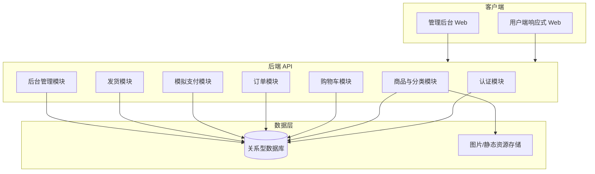
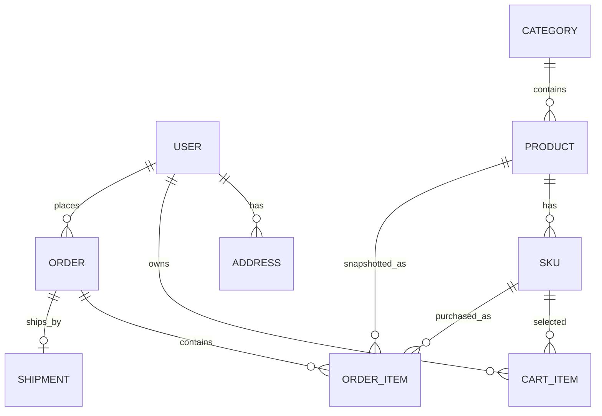
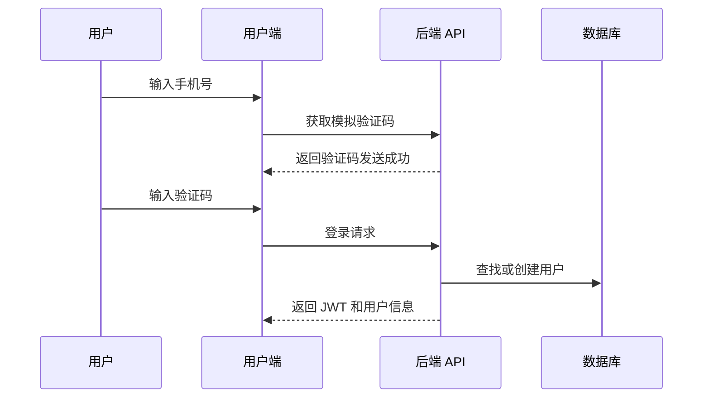
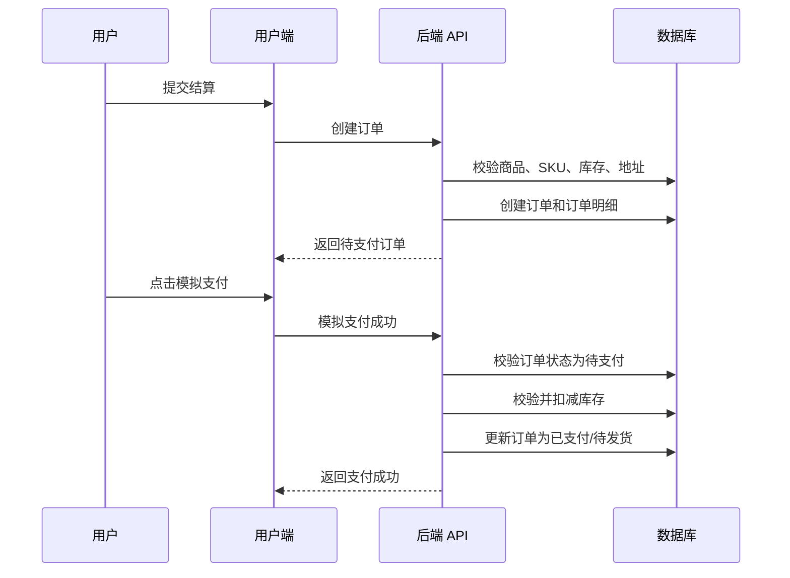
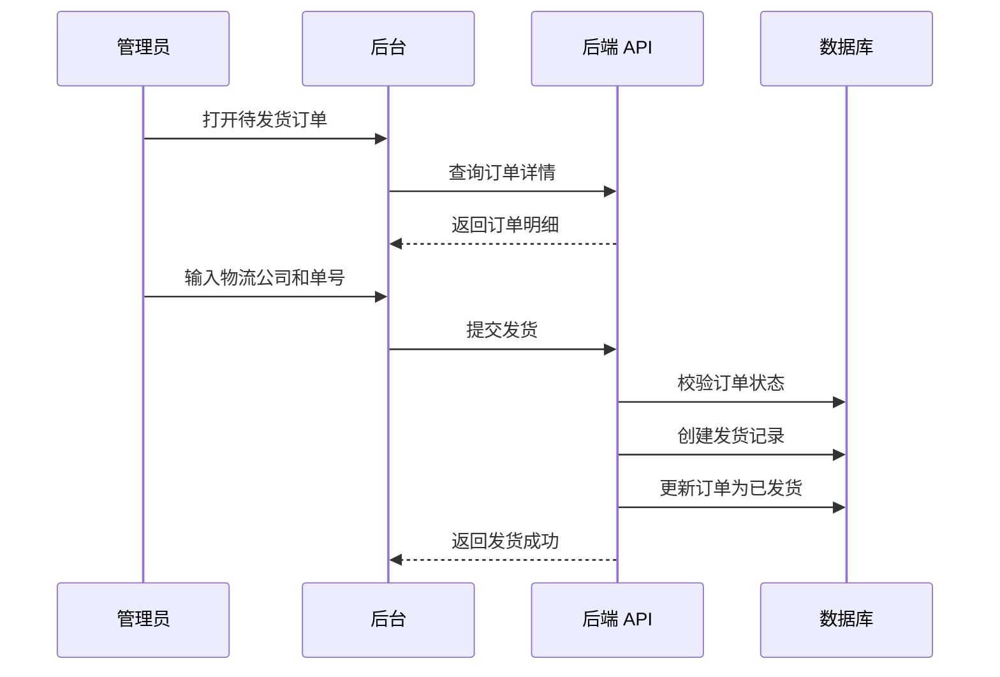
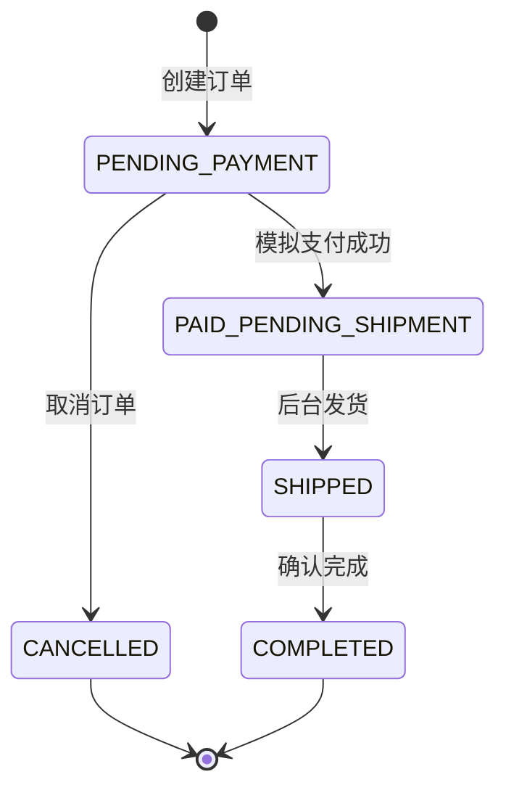
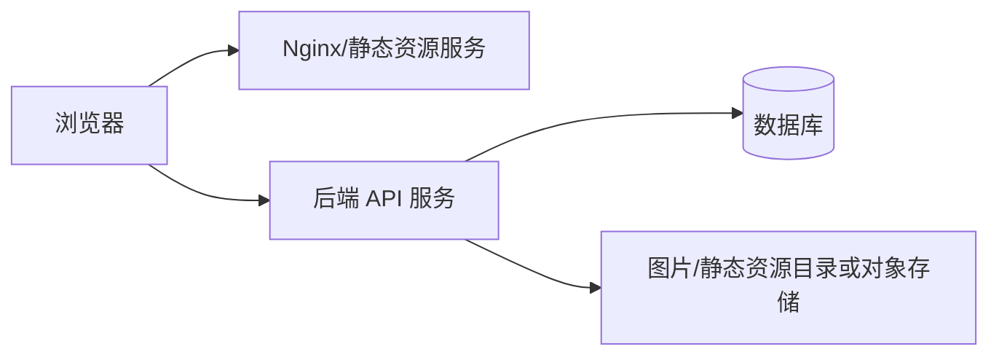

# 小电商平台 MVP 概要设计

## 1. 文档信息

| 字段 | 内容 |
| --- | --- |
| 产品名称 | KKMall 小电商平台 |
| 文档类型 | 概要设计 |
| 版本 | v0.1 |
| 日期 | 2026-04-29 |
| 依据文档 | `docs/prd.md` |

## 2. 设计目标

### 2.1 目标

- 支撑 PRD 中定义的 MVP 闭环：浏览商品、加入购物车、结算下单、模拟支付、后台发货、用户查看订单。
- 采用前后端分离架构，用户端和管理后台共享同一套后端 API。
- 保持系统简单可落地，避免为第一版引入真实支付、真实短信、营销、售后、复杂仓储等非 MVP 能力。
- 为后续扩展真实支付、短信、营销、售后预留清晰边界，但不在第一版实现。

### 2.2 设计原则

- 业务优先：围绕交易主链路组织模块。
- 单体优先：MVP 使用模块化单体，降低部署和调试复杂度。
- 服务端可信：价格、运费、库存、订单状态都由服务端计算和校验。
- 状态明确：订单状态流转集中管理，避免前端自行推断。
- 前台后台隔离：用户端和后台权限、路由、接口能力清晰区分。

## 3. 总体架构

### 3.1 架构形态

MVP 采用前后端分离 + 模块化单体后端：

- 用户端 Web：响应式商城页面，覆盖 PC 和移动端。
- 管理后台 Web：商品、订单、发货管理。
- 后端 API：统一承载用户、商品、购物车、订单、模拟支付、发货能力。
- 数据库：关系型数据库存储核心业务数据。
- 对象存储：商品图片可以在 MVP 阶段先使用本地静态资源或对象存储抽象，具体实现后续按开发环境决定。



### 3.2 推荐技术栈

概要设计先给出默认技术选型，后续如已有团队偏好可替换：

| 层级 | 推荐方案 | 说明 |
| --- | --- | --- |
| 用户端/后台 | React + TypeScript + Vite | 单仓库可同时承载商城和后台页面 |
| UI | Ant Design 或 shadcn/ui 二选一 | 后台偏 Ant Design 更快，用户端可定制样式 |
| 状态管理 | React Query + Zustand | React Query 管服务端数据，Zustand 管购物车/UI 状态 |
| 后端 | Spring Boot 3 或 NestJS 二选一 | 若团队 Java 背景强，优先 Spring Boot；若全栈 JS 背景强，优先 NestJS |
| 数据库 | MySQL/PostgreSQL | MVP 使用单库即可 |
| ORM | MyBatis/JPA 或 Prisma/TypeORM | 跟随后端栈选择 |
| 鉴权 | JWT | 用户端和后台使用不同角色权限 |

默认实现建议：如果没有其他约束，使用 React + TypeScript + Spring Boot 3 + MySQL。

## 4. 系统模块划分

### 4.1 用户认证模块

职责：

- 手机号 + 模拟验证码登录。
- 用户会话管理。
- 用户端接口鉴权。
- 后台管理员登录与角色识别。

核心设计：

- 模拟验证码可固定为 `123456`，或在开发环境生成后返回给前端。
- 用户端角色为 `CUSTOMER`。
- 后台角色为 `ADMIN`。
- JWT 中保存用户 ID、角色、过期时间。

### 4.2 商品与分类模块

职责：

- 分类管理。
- 商品管理。
- SKU 管理。
- 用户端商品浏览。

核心设计：

- 商品为 SPU，SKU 为实际售卖和库存单位。
- 用户端只展示已上架商品和启用分类。
- 后台可以查看全部商品，包括下架商品。
- SKU 价格和库存以服务端数据库为准。

### 4.3 购物车模块

职责：

- 加入购物车。
- 修改数量。
- 删除商品。
- 查询购物车。
- 结算前库存和上下架校验。

核心设计：

- MVP 购物车持久化到数据库，便于简单可靠地支持多端登录后同步。
- 购物车项以 `userId + skuId` 唯一。
- 相同 SKU 重复加购时累加数量。
- 购物车展示可保留商品快照字段，但结算价格必须实时读取 SKU 价格。

### 4.4 订单模块

职责：

- 创建订单。
- 查询用户订单列表和详情。
- 管理订单状态。
- 保存订单商品快照、价格快照和地址快照。

核心设计：

- 创建订单时复制商品标题、图片、SKU 规格、单价到订单明细，避免后续商品修改影响历史订单。
- 创建订单时不扣库存，模拟支付成功时扣库存。
- 订单金额、运费、应付金额均由服务端计算。
- 用户只能访问自己的订单。

### 4.5 模拟支付模块

职责：

- 发起模拟支付。
- 确认模拟支付成功。
- 将订单从“待支付”推进到“已支付/待发货”。
- 扣减 SKU 库存。

核心设计：

- 仅支持订单全额模拟支付。
- 支付成功接口需要幂等：同一订单重复支付成功请求不能重复扣库存。
- 支付成功时再次校验订单状态和 SKU 库存。
- 库存不足时支付失败，订单保持“待支付”或进入后续人工处理状态；MVP 建议保持“待支付”并返回库存不足。

### 4.6 发货模块

职责：

- 后台录入物流公司和物流单号。
- 创建发货记录。
- 将订单状态改为“已发货”。
- 用户端展示物流信息。

核心设计：

- 只有“已支付/待发货”订单可以发货。
- 一个订单 MVP 只支持一次整单发货，不支持拆单、分批发货。
- 不接第三方物流轨迹 API，只展示后台录入的物流公司、物流单号、发货时间。

### 4.7 后台管理模块

职责：

- 商品管理。
- 分类管理。
- SKU 管理。
- 订单管理。
- 发货管理。

核心设计：

- 后台和用户端共享商品、订单数据表。
- 后台接口统一加 `/admin` 路由前缀。
- 后台操作需要管理员角色。
- MVP 不做细粒度 RBAC，只区分用户和管理员。

## 5. 核心数据模型

### 5.1 实体关系



### 5.2 表设计概览

| 表 | 说明 | 关键字段 |
| --- | --- | --- |
| `users` | 用户 | `id`, `phone`, `nickname`, `role`, `created_at` |
| `addresses` | 收货地址 | `id`, `user_id`, `receiver_name`, `receiver_phone`, `region`, `detail`, `is_default` |
| `categories` | 分类 | `id`, `name`, `sort_order`, `enabled` |
| `products` | 商品 SPU | `id`, `category_id`, `title`, `description`, `images`, `status` |
| `skus` | 商品 SKU | `id`, `product_id`, `spec_name`, `spec_value`, `price`, `stock` |
| `cart_items` | 购物车 | `id`, `user_id`, `product_id`, `sku_id`, `quantity` |
| `orders` | 订单主表 | `id`, `order_no`, `user_id`, `product_amount`, `shipping_fee`, `payable_amount`, `status`, `address_snapshot` |
| `order_items` | 订单明细 | `id`, `order_id`, `product_id`, `sku_id`, `title_snapshot`, `sku_snapshot`, `unit_price`, `quantity`, `subtotal` |
| `shipments` | 发货记录 | `id`, `order_id`, `logistics_company`, `tracking_no`, `shipped_at` |

### 5.3 金额字段约定

- 金额字段使用整数分存储，避免浮点误差。
- 前端展示时转换为元。
- 订单金额以订单创建时服务端计算结果为准。

### 5.4 快照字段约定

- `orders.address_snapshot` 保存下单时收货人、手机号、省市区、详细地址。
- `order_items.title_snapshot` 保存下单时商品标题。
- `order_items.sku_snapshot` 保存下单时 SKU 规格信息。
- 快照用于历史订单展示，不随商品或地址后续修改而变化。

## 6. API 概要设计

### 6.1 通用约定

请求路径统一使用 `/api/v1` 前缀。

成功响应：

```json
{
  "code": 0,
  "message": "success",
  "data": {}
}
```

失败响应：

```json
{
  "code": "ORDER_STOCK_NOT_ENOUGH",
  "message": "库存不足",
  "data": null
}
```

### 6.2 用户端 API

| 方法 | 路径 | 说明 |
| --- | --- | --- |
| `POST` | `/api/v1/auth/mock-code` | 获取模拟验证码 |
| `POST` | `/api/v1/auth/login` | 手机号验证码登录 |
| `GET` | `/api/v1/categories` | 分类列表 |
| `GET` | `/api/v1/products` | 商品列表 |
| `GET` | `/api/v1/products/{id}` | 商品详情 |
| `GET` | `/api/v1/cart` | 查询购物车 |
| `POST` | `/api/v1/cart/items` | 加入购物车 |
| `PATCH` | `/api/v1/cart/items/{id}` | 修改购物车数量 |
| `DELETE` | `/api/v1/cart/items/{id}` | 删除购物车项 |
| `GET` | `/api/v1/addresses` | 收货地址列表 |
| `POST` | `/api/v1/addresses` | 新增收货地址 |
| `POST` | `/api/v1/orders` | 创建订单 |
| `GET` | `/api/v1/orders` | 用户订单列表 |
| `GET` | `/api/v1/orders/{id}` | 用户订单详情 |
| `POST` | `/api/v1/payments/mock` | 模拟支付成功 |

### 6.3 后台 API

| 方法 | 路径 | 说明 |
| --- | --- | --- |
| `POST` | `/api/v1/admin/auth/login` | 后台登录 |
| `GET` | `/api/v1/admin/categories` | 后台分类列表 |
| `POST` | `/api/v1/admin/categories` | 新增分类 |
| `GET` | `/api/v1/admin/products` | 后台商品列表 |
| `POST` | `/api/v1/admin/products` | 新增商品 |
| `PUT` | `/api/v1/admin/products/{id}` | 编辑商品 |
| `PATCH` | `/api/v1/admin/products/{id}/status` | 上下架商品 |
| `GET` | `/api/v1/admin/orders` | 后台订单列表 |
| `GET` | `/api/v1/admin/orders/{id}` | 后台订单详情 |
| `POST` | `/api/v1/admin/orders/{id}/shipment` | 订单发货 |

## 7. 核心流程设计

### 7.1 登录流程



### 7.2 下单与模拟支付流程



### 7.3 后台发货流程



## 8. 订单状态设计

### 8.1 状态枚举

| 状态 | 编码 | 说明 |
| --- | --- | --- |
| 待支付 | `PENDING_PAYMENT` | 订单已创建，等待模拟支付 |
| 已支付/待发货 | `PAID_PENDING_SHIPMENT` | 支付成功，等待后台发货 |
| 已发货 | `SHIPPED` | 后台已录入物流信息 |
| 已完成 | `COMPLETED` | 订单完成 |
| 已取消 | `CANCELLED` | 待支付订单被取消 |

### 8.2 状态流转



### 8.3 状态约束

- 只有 `PENDING_PAYMENT` 可以模拟支付。
- 只有 `PENDING_PAYMENT` 可以取消。
- 只有 `PAID_PENDING_SHIPMENT` 可以发货。
- 只有 `SHIPPED` 可以完成。
- MVP 不提供退款、退货、售后状态。

## 9. 关键业务规则设计

### 9.1 运费计算

输入：

- 商品金额 `productAmount`

规则：

- `productAmount >= 9900` 时，`shippingFee = 0`。
- `productAmount < 9900` 时，`shippingFee = 1000`。
- `payableAmount = productAmount + shippingFee`。

### 9.2 库存扣减

- 加入购物车时校验 SKU 存在和商品上架状态。
- 创建订单时校验 SKU 存在、商品上架、库存不少于购买数量。
- 模拟支付成功时再次校验库存并扣减。
- 同一订单重复支付成功请求不能重复扣减库存。

### 9.3 商品上下架

- 上架商品可以在用户端展示和购买。
- 下架商品不在用户端展示。
- 如果购物车中已有商品被下架，购物车仍可展示，但不可结算。
- 已创建订单不受商品后续上下架影响。

## 10. 前端概要设计

### 10.1 用户端路由

| 路由 | 页面 |
| --- | --- |
| `/` | 首页 |
| `/products` | 商品列表 |
| `/products/:id` | 商品详情 |
| `/login` | 登录 |
| `/cart` | 购物车 |
| `/checkout` | 结算 |
| `/pay/:orderId` | 模拟支付 |
| `/orders` | 订单列表 |
| `/orders/:id` | 订单详情 |

### 10.2 后台路由

| 路由 | 页面 |
| --- | --- |
| `/admin/login` | 后台登录 |
| `/admin/products` | 商品列表 |
| `/admin/products/new` | 新增商品 |
| `/admin/products/:id/edit` | 编辑商品 |
| `/admin/orders` | 订单列表 |
| `/admin/orders/:id` | 订单详情与发货 |

### 10.3 前端状态

- 登录态：JWT、用户信息、角色。
- 购物车：优先从服务端读取，前端仅缓存当前展示数据。
- 订单：使用服务端数据，不在前端自行维护状态机。
- 表单：商品编辑、地址、发货表单使用页面局部状态。

## 11. 安全与权限设计

- 用户端受限接口必须要求用户登录。
- 用户只能访问自己的购物车、地址和订单。
- 后台接口必须要求管理员角色。
- 前端隐藏入口不能作为权限控制依据，后端必须做权限校验。
- 手机号在后台订单列表中可展示完整值，在用户公共展示场景需要脱敏。
- 订单金额、库存、运费必须由后端重新计算，不接受前端传入金额作为最终金额。

## 12. 部署概要

MVP 可以采用简单部署：



部署建议：

- 前端构建后作为静态资源部署。
- 后端 API 单实例部署即可。
- 数据库单实例即可，后续按业务量扩展。
- 图片存储 MVP 可先本地目录，后续替换对象存储时保持 URL 字段不变。

## 13. 后续详细设计拆分

概要设计完成后，建议按以下顺序进入详细设计：

1. 数据库详细设计：表结构、字段类型、索引、约束。
2. 接口详细设计：请求/响应 DTO、错误码、权限要求。
3. 订单详细设计：订单创建、支付、发货、状态机、库存扣减。
4. 前端页面设计：页面布局、组件、交互状态。
5. 测试设计：单元测试、接口测试、端到端主流程测试。

## 14. MVP 不做事项

- 不接真实短信服务。
- 不接微信支付、支付宝或银行卡支付。
- 不做优惠券、积分、满减。
- 不做评价、社区、AI 推荐。
- 不做系统售后、退款、退货。
- 不做多商家、店铺、分账。
- 不做复杂仓储、物流轨迹查询、拆单发货。
- 不做后台首页装修。
