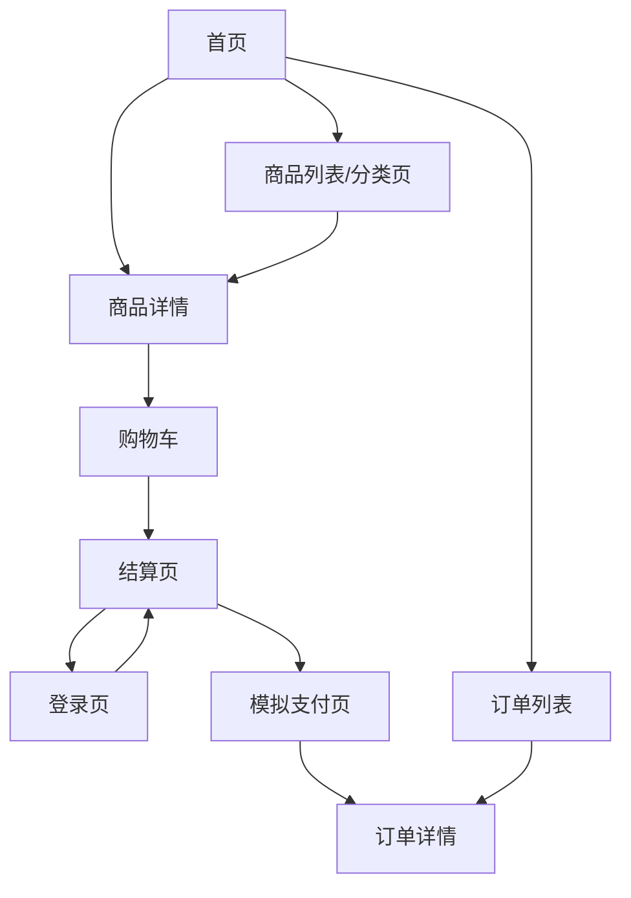
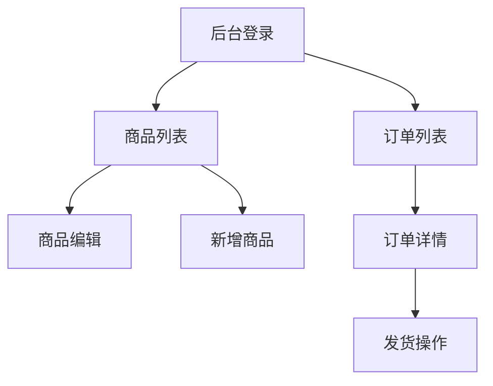

# 小电商平台 MVP 页面原型设计

## 1. 文档信息

| 字段 | 内容 |
| --- | --- |
| 产品名称 | KKMall 小电商平台 |
| 文档类型 | 页面原型设计 |
| 版本 | v0.1 |
| 日期 | 2026-04-29 |
| 依据文档 | `docs/prd.md`, `docs/overview-design.md`, `docs/detail-design.md` |

## 2. 原型目标

本原型用于确定 MVP 阶段页面结构、核心组件和交互路径，不包含最终视觉风格。

设计目标：

- 用户端优先保证购物主链路顺畅。
- 后台优先保证商品维护、订单查看和发货高效。
- PC 与移动端共用信息架构，通过响应式布局适配。
- 不出现退款、优惠券、评价、多商家、社区、AI 推荐、首页装修等非 MVP 功能入口。

## 3. 信息架构

### 3.1 用户端



### 3.2 管理后台



## 4. 用户端全局布局

### 4.1 PC 布局

```text
┌──────────────────────────────────────────────────────────────┐
│ Logo / 搜索框 / 购物车 / 订单 / 登录状态                     │
├──────────────────────────────────────────────────────────────┤
│ 页面主体                                                     │
│                                                              │
│ 根据页面展示首页、商品列表、详情、购物车、结算、订单等内容   │
│                                                              │
├──────────────────────────────────────────────────────────────┤
│ 页脚：备案/客服说明/售后线下处理提示                         │
└──────────────────────────────────────────────────────────────┘
```

### 4.2 移动端布局

```text
┌────────────────────────────┐
│ Logo / 搜索入口 / 购物车   │
├────────────────────────────┤
│ 页面主体                   │
│ 单列内容，底部关键操作固定 │
├────────────────────────────┤
│ 底部导航：首页/分类/购物车/订单 │
└────────────────────────────┘
```

移动端原则：

- 商品详情、购物车、结算页的主操作按钮固定在底部。
- 商品列表使用双列商品瀑布/网格。
- 表单字段单列展示。
- 不在移动端展示复杂筛选面板，只保留分类和关键词。

## 5. 用户端页面原型

### 5.1 首页

目标：让用户快速进入商品浏览和购买路径。

```text
┌──────────────────────────────────────────────┐
│ Header: Logo | 搜索商品 | 购物车 | 我的订单  │
├──────────────────────────────────────────────┤
│ Banner: 固定运营图                           │
├──────────────────────────────────────────────┤
│ 分类入口: 服饰 | 数码 | 家居 | 更多          │
├──────────────────────────────────────────────┤
│ 推荐商品                                     │
│ [商品卡] [商品卡] [商品卡] [商品卡]          │
├──────────────────────────────────────────────┤
│ 全部商品                                     │
│ [商品卡] [商品卡] [商品卡] [商品卡]          │
│ [商品卡] [商品卡] [商品卡] [商品卡]          │
└──────────────────────────────────────────────┘
```

核心组件：

- Header：Logo、搜索框、购物车入口、订单入口、登录状态。
- Banner：固定图片，不提供后台配置入口。
- 分类入口：点击进入商品列表并带上分类参数。
- 商品卡：图片、标题、价格、库存状态。

交互：

- 点击商品卡进入商品详情。
- 搜索关键词后进入商品列表。
- 未登录点击订单入口跳转登录页。

### 5.2 商品列表/分类页

目标：展示分类下商品，支持基础查找。

```text
┌──────────────────────────────────────────────┐
│ Header                                       │
├──────────────────────────────────────────────┤
│ 当前分类 / 搜索关键词                         │
├──────────────────────────────────────────────┤
│ 分类 Tabs: 全部 | 服饰 | 数码 | 家居          │
├──────────────────────────────────────────────┤
│ 商品网格                                     │
│ [商品卡] [商品卡] [商品卡] [商品卡]          │
│ [商品卡] [商品卡] [商品卡] [商品卡]          │
└──────────────────────────────────────────────┘
```

状态：

- 空列表：展示“暂无商品”。
- 加载中：商品卡骨架屏。
- 商品下架：用户端不展示。

### 5.3 商品详情页

目标：让用户理解商品并选择 SKU 加入购物车。

```text
┌──────────────────────────────────────────────┐
│ Header                                       │
├──────────────────────┬───────────────────────┤
│ 商品图片区           │ 商品标题               │
│ 主图 + 缩略图        │ 价格                   │
│                      │ SKU 选择               │
│                      │ 数量选择               │
│                      │ 库存状态               │
│                      │ [加入购物车] [去结算]  │
├──────────────────────┴───────────────────────┤
│ 商品描述                                     │
└──────────────────────────────────────────────┘
```

移动端：

```text
┌────────────────────────────┐
│ Header                     │
├────────────────────────────┤
│ 商品图片轮播               │
├────────────────────────────┤
│ 标题 / 价格 / 库存         │
├────────────────────────────┤
│ SKU 选择                   │
├────────────────────────────┤
│ 商品描述                   │
├────────────────────────────┤
│ 底部固定: 加入购物车 / 去结算 │
└────────────────────────────┘
```

交互：

- 未选择 SKU 时点击加入购物车，提示“请选择规格”。
- SKU 库存为 0 时禁用购买按钮。
- 加入购物车成功后显示轻提示，并允许继续浏览。
- 去结算可以先加入购物车，再跳转购物车或结算页；MVP 建议跳转购物车，降低立即购买复杂度。

### 5.4 登录页

目标：让用户用手机号快速登录。

```text
┌────────────────────────────┐
│ Logo                       │
├────────────────────────────┤
│ 手机号输入框               │
│ 验证码输入框 [获取验证码]  │
│ [登录]                     │
├────────────────────────────┤
│ 提示：MVP 使用模拟验证码   │
└────────────────────────────┘
```

交互：

- 获取验证码调用模拟验证码接口。
- 验证码固定为 `123456`。
- 登录成功后跳回 `redirect` 参数对应页面。

### 5.5 购物车页

目标：让用户确认商品、数量和金额后进入结算。

```text
┌──────────────────────────────────────────────┐
│ Header                                       │
├──────────────────────────────────────────────┤
│ 购物车商品                                   │
│ [选择] 图片 标题 SKU 单价 数量步进 小计 删除 │
│ [选择] 图片 标题 SKU 单价 数量步进 小计 删除 │
├──────────────────────────────────────────────┤
│ 金额汇总: 商品金额                           │
│ [去结算]                                     │
└──────────────────────────────────────────────┘
```

移动端：

```text
┌────────────────────────────┐
│ Header                     │
├────────────────────────────┤
│ 商品项                     │
│ 图片 标题                  │
│ SKU / 单价 / 数量 / 删除   │
├────────────────────────────┤
│ 底部固定: 合计 / 去结算    │
└────────────────────────────┘
```

状态：

- 空购物车：展示返回首页按钮。
- 库存不足：商品项标记“库存不足”，禁止结算。
- 商品下架：商品项标记“已下架”，禁止结算。

### 5.6 结算页

目标：确认收货地址、商品清单、运费和应付金额。

```text
┌──────────────────────────────────────────────┐
│ Header                                       │
├──────────────────────────────────────────────┤
│ 收货地址                                     │
│ 收货人 / 手机号 / 省市区 / 详细地址          │
│ [新增或编辑地址]                             │
├──────────────────────────────────────────────┤
│ 商品清单                                     │
│ 图片 标题 SKU 单价 数量 小计                 │
├──────────────────────────────────────────────┤
│ 金额明细                                     │
│ 商品金额: ¥98.00                             │
│ 运费: ¥10.00                                 │
│ 包邮提示: 满 ¥99.00 包邮                     │
│ 应付金额: ¥108.00                            │
│ [提交订单]                                   │
└──────────────────────────────────────────────┘
```

交互：

- 没有地址时，地址区展示新增地址表单。
- 提交订单前服务端重新校验价格、库存、上下架状态。
- 提交成功后跳转模拟支付页。

### 5.7 模拟支付页

目标：完成 MVP 支付闭环。

```text
┌────────────────────────────┐
│ 订单号                     │
│ 应付金额                   │
│ 支付方式: 模拟支付         │
│ [确认模拟支付]             │
└────────────────────────────┘
```

交互：

- 点击确认模拟支付后调用支付接口。
- 成功后跳转订单详情页。
- 库存不足时提示失败，并保留在当前页。

### 5.8 订单列表页

目标：让用户查看历史订单。

```text
┌──────────────────────────────────────────────┐
│ Header                                       │
├──────────────────────────────────────────────┤
│ 状态筛选: 全部 | 待支付 | 待发货 | 已发货   │
├──────────────────────────────────────────────┤
│ 订单卡片                                     │
│ 订单号 / 状态 / 商品摘要 / 金额 / 查看详情   │
│ 订单卡片                                     │
└──────────────────────────────────────────────┘
```

### 5.9 订单详情页

目标：展示订单明细、状态和物流信息。

```text
┌──────────────────────────────────────────────┐
│ Header                                       │
├──────────────────────────────────────────────┤
│ 订单状态: 已发货                             │
│ 订单号 / 创建时间 / 支付时间 / 发货时间      │
├──────────────────────────────────────────────┤
│ 收货地址快照                                 │
├──────────────────────────────────────────────┤
│ 商品明细                                     │
├──────────────────────────────────────────────┤
│ 金额明细                                     │
├──────────────────────────────────────────────┤
│ 物流信息                                     │
│ 物流公司: 顺丰速运                           │
│ 物流单号: SF1234567890                       │
└──────────────────────────────────────────────┘
```

状态：

- 待支付：展示去支付按钮。
- 已支付/待发货：展示等待商家发货。
- 已发货：展示物流公司和物流单号。
- 已完成：展示完成状态。
- 已取消：展示取消状态。

## 6. 管理后台页面原型

### 6.1 后台全局布局

```text
┌──────────────────────────────────────────────┐
│ 顶部栏: KKMall 管理后台 / 管理员 / 退出      │
├──────────────┬───────────────────────────────┤
│ 侧边栏       │ 主内容区                       │
│ 商品管理     │                               │
│ 订单管理     │                               │
└──────────────┴───────────────────────────────┘
```

后台原则：

- 信息密度高于用户端。
- 列表页优先提供筛选、状态、操作按钮。
- 发货操作在订单详情中完成，不单独做复杂仓储页面。

### 6.2 后台登录页

```text
┌────────────────────────────┐
│ KKMall 管理后台            │
├────────────────────────────┤
│ 手机号/账号输入            │
│ 验证码/密码输入            │
│ [登录]                     │
└────────────────────────────┘
```

MVP 建议：

- 复用手机号 + 模拟验证码登录。
- 管理员账户由种子数据初始化。

### 6.3 商品列表页

```text
┌──────────────────────────────────────────────┐
│ 商品管理                         [新增商品] │
├──────────────────────────────────────────────┤
│ 筛选: 关键词 | 分类 | 状态 | [查询]          │
├──────────────────────────────────────────────┤
│ 表格                                         │
│ 图片 | 标题 | 分类 | 最低价 | 总库存 | 状态 | 操作 │
│      |      |      |        |        |      | 编辑/上架/下架 │
└──────────────────────────────────────────────┘
```

交互：

- 点击新增商品进入商品编辑页。
- 点击编辑进入编辑页。
- 上架/下架需要二次确认。
- 下架后用户端不展示该商品。

### 6.4 商品编辑页

```text
┌──────────────────────────────────────────────┐
│ 新增/编辑商品                                │
├──────────────────────────────────────────────┤
│ 基础信息                                     │
│ 商品标题                                     │
│ 分类                                         │
│ 商品描述                                     │
│ 商品图片 URL                                 │
├──────────────────────────────────────────────┤
│ SKU 信息                                     │
│ 规格名 | 规格值 | 价格 | 库存 | 操作         │
│ [新增 SKU]                                   │
├──────────────────────────────────────────────┤
│ [保存草稿] [保存并上架]                      │
└──────────────────────────────────────────────┘
```

校验：

- 商品标题必填。
- 分类必选。
- 至少一个 SKU。
- SKU 价格不能小于 0。
- SKU 库存不能小于 0。

### 6.5 订单列表页

```text
┌──────────────────────────────────────────────┐
│ 订单管理                                     │
├──────────────────────────────────────────────┤
│ 筛选: 订单号 | 手机号 | 状态 | 日期 | [查询] │
├──────────────────────────────────────────────┤
│ 表格                                         │
│ 订单号 | 用户手机号 | 金额 | 状态 | 创建时间 | 操作 │
│        |          |      |      |          | 查看详情 │
└──────────────────────────────────────────────┘
```

状态筛选：

- 全部。
- 待支付。
- 已支付/待发货。
- 已发货。
- 已完成。
- 已取消。

### 6.6 订单详情与发货页

```text
┌──────────────────────────────────────────────┐
│ 订单详情                                     │
├──────────────────────────────────────────────┤
│ 订单信息: 订单号 / 状态 / 创建时间 / 支付时间 │
├──────────────────────────────────────────────┤
│ 用户与收货地址                               │
├──────────────────────────────────────────────┤
│ 商品明细表                                   │
├──────────────────────────────────────────────┤
│ 金额明细                                     │
├──────────────────────────────────────────────┤
│ 发货信息                                     │
│ 若待发货: 物流公司输入 / 物流单号输入 / [确认发货] │
│ 若已发货: 展示物流公司 / 物流单号 / 发货时间 │
└──────────────────────────────────────────────┘
```

交互：

- 只有 `已支付/待发货` 订单展示发货表单。
- 确认发货前校验物流公司和物流单号。
- 发货成功后刷新订单状态为 `已发货`。

## 7. 核心组件规范

### 7.1 商品卡

展示字段：

- 商品图片。
- 商品标题。
- 最低价格。
- 库存状态。

操作：

- 点击进入商品详情。

### 7.2 SKU 选择器

状态：

- 未选中。
- 已选中。
- 售罄禁用。

交互：

- 选择 SKU 后更新价格和库存状态。
- 售罄 SKU 不可选。

### 7.3 数量步进器

规则：

- 最小数量为 1。
- 最大数量不能超过 SKU 库存。
- 达到库存上限时禁用增加按钮。

### 7.4 金额明细

字段：

- 商品金额。
- 运费。
- 包邮提示。
- 应付金额。

规则：

- 未满 99 元展示“还差 ¥x.xx 包邮”。
- 满 99 元展示“已包邮”。

### 7.5 状态标签

订单状态颜色建议：

- 待支付：橙色。
- 已支付/待发货：蓝色。
- 已发货：绿色。
- 已完成：灰绿色。
- 已取消：灰色。

## 8. 关键交互状态

### 8.1 未登录拦截

触发页面：

- 购物车。
- 结算。
- 模拟支付。
- 订单列表。
- 订单详情。

行为：

- 跳转登录页。
- 登录成功后回到原页面。

### 8.2 库存不足

出现位置：

- 商品详情 SKU。
- 购物车商品项。
- 结算提交。
- 模拟支付。

行为：

- 商品详情禁用购买。
- 购物车标记不可结算。
- 结算/支付失败时展示错误提示。

### 8.3 商品下架

出现位置：

- 购物车。
- 结算提交。

行为：

- 商品列表和首页不展示下架商品。
- 购物车保留商品项，但标记已下架。
- 已下架商品不可结算。

### 8.4 发货成功

出现位置：

- 后台订单详情。
- 用户订单详情。

行为：

- 后台发货成功后订单状态变为已发货。
- 用户端展示物流公司、物流单号和发货时间。

## 9. 响应式规则

| 页面 | PC | 移动端 |
| --- | --- | --- |
| 首页 | Banner + 多列商品网格 | Banner + 双列商品网格 |
| 商品列表 | 4 列商品网格 | 2 列商品网格 |
| 商品详情 | 左图右信息 | 图片在上，信息在下，底部固定操作 |
| 购物车 | 表格/横向商品行 | 单列商品项，底部固定结算 |
| 结算 | 左侧地址商品，右侧金额 | 单列，底部固定提交 |
| 后台 | 侧边栏 + 表格 | MVP 后台优先 PC，不强制移动端深度适配 |

## 10. 原型验收标准

- 用户可以从首页进入商品详情，并完成加购、结算、模拟支付、查看订单。
- 后台可以完成商品新增、编辑、上下架、订单查看、发货。
- 移动端关键操作按钮不被遮挡。
- 页面中不出现非 MVP 功能入口。
- 订单状态在用户端和后台展示一致。
- 运费和包邮提示在购物车/结算相关位置表达清楚。
