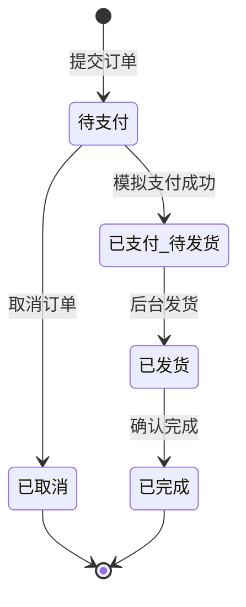

# 小电商平台 MVP PRD

## 1. 文档信息

| 字段 | 内容 |
| --- | --- |
| 产品名称 | KKMall 小电商平台 |
| 文档类型 | MVP 产品需求文档 |
| 版本 | v0.1 |
| 日期 | 2026-04-29 |
| 产品定位 | 面向普通消费者的单商家自营实物商品电商平台 |

## 2. 产品概述

### 2.1 背景

项目需要先从一个可落地、可验证的最小闭环开始，而不是一次性建设完整商城。MVP 阶段重点验证用户能否顺畅完成商品浏览、加入购物车、下单、模拟支付、商家发货、订单查询这一条主链路。

### 2.2 产品目标

- 面向 PC 与移动端浏览器提供响应式商城体验。
- 支持通用实物商品售卖，商品具备分类、SKU、价格、库存等基础能力。
- 支持用户使用手机号与模拟验证码登录。
- 支持购物车、结算、订单、模拟支付、后台发货的交易闭环。
- 支持商家通过后台维护商品并处理订单发货。

### 2.3 MVP 范围

MVP 只做单商家自营商城，不做多商家入驻、真实支付、真实短信、优惠券、评价、系统售后、首页装修、社区内容、AI 推荐、财务报表等能力。

## 3. 目标用户与角色

### 3.1 消费者

普通 C 端用户，通过 PC 或手机浏览器访问商城，完成浏览、加购、下单、查看订单与物流信息。

核心诉求：

- 快速找到可购买商品。
- 清楚看到规格、价格、库存、运费与订单状态。
- 使用手机号快速登录。
- 下单后可以查看发货与物流单号。

### 3.2 商家运营人员

负责商品维护、订单查看、发货录入。

核心诉求：

- 快速创建与上下架商品。
- 维护 SKU 价格与库存。
- 查看待发货订单。
- 录入物流公司与物流单号，完成发货。

## 4. 核心业务流程

### 4.1 用户购物流程

1. 用户访问首页。
2. 用户通过分类或商品列表进入商品详情。
3. 用户选择 SKU 与数量，加入购物车。
4. 用户进入购物车，调整数量或删除商品。
5. 用户进入结算页。
6. 未登录用户先完成手机号 + 模拟验证码登录。
7. 用户填写或选择收货地址。
8. 系统展示商品金额、运费、包邮规则与应付金额。
9. 用户提交订单，订单进入“待支付”。
10. 用户完成模拟支付，订单进入“已支付/待发货”，系统扣减库存。
11. 商家后台录入物流信息后，订单进入“已发货”。
12. 用户在订单详情页查看物流公司与物流单号。

### 4.2 后台发货流程

1. 商家进入订单管理。
2. 筛选“已支付/待发货”订单。
3. 查看订单商品、收货地址、用户手机号和订单金额。
4. 录入物流公司与物流单号。
5. 确认发货。
6. 系统创建发货信息并将订单状态改为“已发货”。

## 5. 功能需求

### 5.1 用户登录

功能说明：

- 用户使用手机号登录。
- 第一版使用模拟验证码，不接真实短信服务。
- 访问购物车、结算、订单页时，如用户未登录，需要进入登录流程。

验收标准：

- 用户输入合法手机号后可以获取模拟验证码。
- 用户输入正确模拟验证码后登录成功。
- 登录成功后可以继续访问原本要进入的受限页面。
- 未登录用户不能提交订单、查看订单或进入结算。

### 5.2 首页

功能说明：

- 首页采用固定运营模块，不做后台装修。
- 模块包含顶部导航、搜索入口、固定轮播位、分类入口、推荐商品区、商品列表。
- 首页内容可先通过固定配置或种子数据提供。

验收标准：

- PC 与移动端都能正常展示首页。
- 首页能进入分类列表和商品详情。
- 首页不提供运营后台装修入口。

### 5.3 商品与分类

功能说明：

- 支持商品分类。
- 商品支持标题、描述、图片、分类、上架状态。
- 商品支持 SKU，SKU 包含规格名、规格值、价格、库存。
- 下架商品不在用户端列表展示，但后台仍可查看和编辑。

验收标准：

- 用户可以按分类浏览商品。
- 用户可以进入商品详情查看图片、标题、描述、SKU、价格、库存状态。
- 用户必须选择有效 SKU 后才能加入购物车。
- SKU 库存不足时不能提交结算。

### 5.4 购物车

功能说明：

- 用户可将商品 SKU 加入购物车。
- 购物车支持修改数量、删除商品。
- 购物车展示商品图片、标题、SKU 规格、单价、数量、小计。
- 购物车需要进行库存校验。

验收标准：

- 相同 SKU 再次加入购物车时数量累加。
- 用户修改数量不能超过当前 SKU 可售库存。
- 删除商品后购物车金额即时更新。
- 购物车总价等于所有选中商品小计之和。

### 5.5 结算与运费

功能说明：

- 结算页展示商品清单、收货地址、商品金额、运费、包邮提示、应付金额。
- 第一版支持填写或选择收货地址。
- 运费规则：商品金额满 99 元包邮，未满 99 元收取 10 元固定运费。

验收标准：

- 商品金额小于 99 元时，运费为 10 元。
- 商品金额大于等于 99 元时，运费为 0 元。
- 应付金额 = 商品金额 + 运费。
- 结算提交前需要再次校验 SKU 上架状态和库存。

### 5.6 订单与模拟支付

功能说明：

- 用户提交结算后创建订单，订单初始状态为“待支付”。
- 第一版使用模拟支付，不接微信支付或支付宝。
- 模拟支付成功后订单进入“已支付/待发货”，并扣减库存。
- 用户可以查看订单列表和订单详情。

验收标准：

- 订单号唯一。
- 支付成功后库存正确扣减。
- 支付成功后订单状态为“已支付/待发货”。
- 用户只能查看自己的订单。
- 订单详情展示商品明细、金额、运费、收货地址、订单状态。

### 5.7 订单发货与物流展示

功能说明：

- 后台支持商家手动发货。
- 发货时录入物流公司和物流单号。
- 发货成功后用户订单详情展示物流信息。

验收标准：

- 只有“已支付/待发货”订单可以执行发货。
- 发货时物流公司和物流单号为必填。
- 发货成功后订单状态变为“已发货”。
- 用户订单详情页能看到物流公司、物流单号和发货时间。

### 5.8 管理后台

功能说明：

- 后台第一版只包含商品管理、订单管理、发货管理。
- 商品管理支持新增、编辑、上下架商品，维护分类、SKU、价格、库存、图片。
- 订单管理支持查看订单列表、订单详情、按状态筛选。
- 发货管理在订单详情或待发货列表内完成。

验收标准：

- 后台可以创建包含至少一个 SKU 的商品。
- 后台可以修改 SKU 价格和库存。
- 后台可以上下架商品。
- 后台可以筛选待发货订单并完成发货。

## 6. 数据对象

### 6.1 User

| 字段 | 说明 |
| --- | --- |
| id | 用户 ID |
| phone | 手机号 |
| nickname | 昵称 |
| defaultAddressId | 默认收货地址 ID |
| createdAt | 创建时间 |

### 6.2 Category

| 字段 | 说明 |
| --- | --- |
| id | 分类 ID |
| name | 分类名称 |
| sortOrder | 排序 |
| enabled | 是否启用 |

### 6.3 Product

| 字段 | 说明 |
| --- | --- |
| id | 商品 ID |
| categoryId | 分类 ID |
| title | 商品标题 |
| description | 商品描述 |
| images | 商品图片 |
| status | 上架状态 |
| createdAt | 创建时间 |
| updatedAt | 更新时间 |

### 6.4 SKU

| 字段 | 说明 |
| --- | --- |
| id | SKU ID |
| productId | 商品 ID |
| specName | 规格名，如颜色、尺码 |
| specValue | 规格值，如黑色、XL |
| price | 售价 |
| stock | 可售库存 |

### 6.5 CartItem

| 字段 | 说明 |
| --- | --- |
| id | 购物车项 ID |
| userId | 用户 ID |
| productId | 商品 ID |
| skuId | SKU ID |
| quantity | 数量 |

### 6.6 Address

| 字段 | 说明 |
| --- | --- |
| id | 地址 ID |
| userId | 用户 ID |
| receiverName | 收货人 |
| receiverPhone | 收货手机号 |
| region | 省市区 |
| detail | 详细地址 |
| isDefault | 是否默认 |

### 6.7 Order

| 字段 | 说明 |
| --- | --- |
| id | 订单 ID |
| orderNo | 订单号 |
| userId | 用户 ID |
| items | 订单商品明细 |
| productAmount | 商品金额 |
| shippingFee | 运费 |
| payableAmount | 应付金额 |
| status | 订单状态 |
| addressSnapshot | 下单时收货地址快照 |
| createdAt | 创建时间 |
| paidAt | 支付时间 |

### 6.8 Shipment

| 字段 | 说明 |
| --- | --- |
| id | 发货记录 ID |
| orderId | 订单 ID |
| logisticsCompany | 物流公司 |
| trackingNo | 物流单号 |
| shippedAt | 发货时间 |

## 7. 订单状态

| 状态 | 说明 |
| --- | --- |
| 待支付 | 用户已提交订单但未完成模拟支付 |
| 已支付/待发货 | 用户已完成模拟支付，等待商家发货 |
| 已发货 | 商家已录入物流信息 |
| 已完成 | 订单完成，MVP 可由后台或后续自动确认扩展 |
| 已取消 | 待支付订单被取消 |

状态流转：

## 8. 业务规则

### 8.1 运费规则

- 商品金额满 99 元包邮。
- 商品金额未满 99 元收取 10 元固定运费。
- 运费只按订单维度计算，不按地区、重量、件数区分。

### 8.2 库存规则

- 商品加入购物车时展示库存状态。
- 提交订单前必须校验库存。
- 模拟支付成功后扣减库存。
- 库存不足时不能创建可支付订单。

### 8.3 售后规则

- MVP 不做系统内退款、退货、换货申请。
- 售后问题通过线下客服处理。
- 用户端和后台不展示退款、退货、售后工单入口。

### 8.4 支付规则

- MVP 只支持模拟支付。
- 不接入微信支付、支付宝或银行卡支付。
- 不处理真实支付回调、退款回调或对账。

### 8.5 首页运营规则

- 首页模块固定。
- MVP 不做后台可视化装修。
- Banner、推荐商品等内容可通过固定配置或种子数据维护。

## 9. 页面清单

### 9.1 用户端

| 页面 | 说明 |
| --- | --- |
| 首页 | 固定运营模块、分类入口、推荐商品、商品列表 |
| 分类/商品列表页 | 按分类展示商品 |
| 商品详情页 | 展示商品信息、图片、SKU、价格、库存、加购按钮 |
| 登录页 | 手机号 + 模拟验证码登录 |
| 购物车页 | 商品列表、数量修改、删除、金额汇总 |
| 结算页 | 地址、商品清单、运费、应付金额、提交订单 |
| 模拟支付页 | 展示订单金额并完成模拟支付 |
| 订单列表页 | 展示用户订单 |
| 订单详情页 | 展示订单明细、状态、收货地址、物流信息 |

### 9.2 管理后台

| 页面 | 说明 |
| --- | --- |
| 后台登录页 | 后台管理员登录，具体认证方式可在实现阶段简化 |
| 商品列表页 | 查看、筛选、上下架商品 |
| 商品编辑页 | 新增/编辑商品、SKU、图片、库存 |
| 订单列表页 | 查看订单并按状态筛选 |
| 订单详情页 | 查看订单详情、收货地址、商品明细 |
| 发货操作区 | 录入物流公司和物流单号 |

## 10. 非功能需求

### 10.1 兼容性

- 支持 PC 浏览器：Chrome、Edge、Safari、Firefox 的现代版本。
- 支持移动端浏览器：iOS Safari、Android Chrome。
- 最小移动端宽度按 375px 设计。

### 10.2 性能

- 首页首屏加载目标：3 秒内。
- 商品列表与详情页基础数据加载目标：2 秒内。
- 提交订单与模拟支付操作目标：2 秒内返回结果。

### 10.3 安全

- 用户订单接口必须校验登录状态和用户归属。
- 后台接口必须与用户端权限隔离。
- 手机号展示时建议脱敏。
- 订单金额、运费、库存等关键数据必须由服务端计算和校验。

## 11. 验收测试

### 11.1 用户登录

- 输入手机号和正确模拟验证码后登录成功。
- 未登录访问购物车、结算、订单页时进入登录流程。
- 登录后能回到原目标页面继续操作。

### 11.2 商品浏览与加购

- 用户可以浏览首页、分类列表和商品详情。
- 用户选择 SKU 后可以加入购物车。
- 未选择 SKU 时不能加入购物车。
- 库存不足 SKU 不能进入结算。

### 11.3 购物车与结算

- 购物车可以修改数量、删除商品。
- 购物车金额计算正确。
- 商品金额 98 元时运费为 10 元。
- 商品金额 99 元时运费为 0 元。
- 应付金额计算正确。

### 11.4 订单与支付

- 用户提交订单后生成“待支付”订单。
- 模拟支付成功后订单变为“已支付/待发货”。
- 支付成功后 SKU 库存扣减正确。
- 用户只能查看自己的订单。

### 11.5 后台商品管理

- 后台可以新增商品并配置 SKU。
- 后台可以编辑 SKU 价格和库存。
- 后台可以上下架商品。
- 下架商品不在用户端展示。

### 11.6 后台订单与发货

- 后台可以查看订单列表和订单详情。
- 后台可以筛选“已支付/待发货”订单。
- 后台录入物流公司和物流单号后订单变为“已发货”。
- 用户订单详情可以看到物流公司、物流单号和发货时间。

### 11.7 范围控制

- 用户端不出现退款、退货、优惠券、评价、多店铺、社区内容入口。
- 后台不出现首页装修、营销配置、多商家管理、财务报表入口。
- 支付和短信不调用真实第三方服务。

## 12. 默认假设

- 平台为单商家自营商城。
- 第一版只支持实物商品。
- 第一版只支持 PC + 移动端响应式 Web。
- 第一版短信验证码和支付都使用模拟能力。
- 默认固定运费为 10 元，满 99 元包邮。
- 售后通过线下客服处理，系统内不提供退款/退货申请。
- PRD 后续可继续拆分为详细设计、接口文档、数据库设计和开发任务清单。
