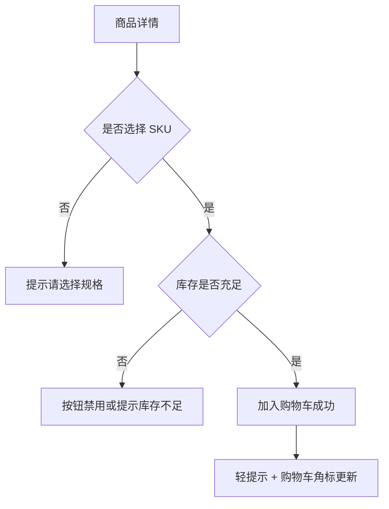
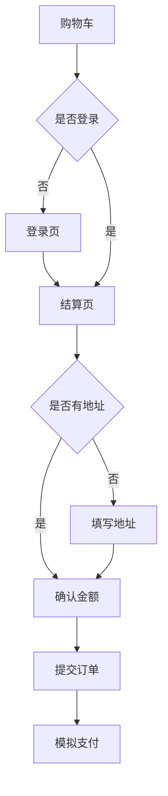
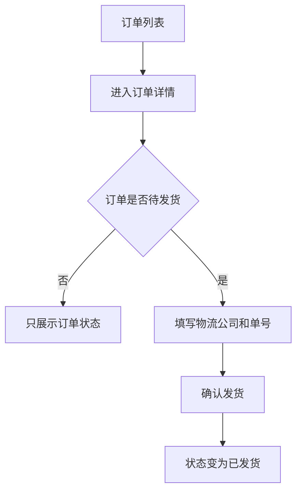

# 小电商平台 MVP UI/UX 设计

## 1. 文档信息

| 字段 | 内容 |
| --- | --- |
| 产品名称 | KKMall 小电商平台 |
| 文档类型 | UI/UX 设计 |
| 版本 | v0.1 |
| 日期 | 2026-04-29 |
| 依据文档 | `docs/prd.md`, `docs/page-prototype.md` |
| 风格参考 | 天猫式电商体验：红色品牌识别、强搜索、商品卡流、促销感、清晰购买路径 |

## 2. 设计定位

### 2.1 设计关键词

- 鲜明：用红色建立电商购买氛围。
- 高效：首屏让用户能搜索、进分类、看商品。
- 可信：商品、价格、库存、订单状态表达清楚。
- 热闹但克制：借鉴天猫促销感，但避免过度堆砌。
- 移动优先：移动端保留强购买按钮和高效商品浏览。

### 2.2 与天猫的关系

本项目只借鉴天猫电商体验中的通用设计语言：

- 红色主色。
- 大搜索框。
- 分类入口。
- 商品卡片流。
- 价格和促销信息突出。
- 结算链路清晰。

不使用：

- 天猫 Logo、猫头形象、品牌资产。
- 天猫页面截图、素材、图标或文案。
- 天猫专有交互或商标化视觉元素。

## 3. 视觉风格

### 3.1 色彩系统

| 用途 | 色值 | 说明 |
| --- | --- | --- |
| 品牌红 | `#FF0036` | 主按钮、价格强调、活动标签 |
| 深红 | `#C4002F` | Hover、强调背景、危险操作确认 |
| 浅红背景 | `#FFF1F3` | 促销提示、包邮提示、选中态背景 |
| 金色强调 | `#FFB800` | 小型利益点、热卖角标 |
| 正文黑 | `#1F1F1F` | 商品标题、主要文本 |
| 次级灰 | `#666666` | 描述、辅助信息 |
| 弱灰 | `#999999` | 占位、时间、库存弱提示 |
| 分割线 | `#EEEEEE` | 边框、列表分割 |
| 页面底色 | `#F5F5F5` | 用户端页面背景 |
| 白色 | `#FFFFFF` | 卡片和内容容器 |
| 成功绿 | `#12B76A` | 已发货、成功状态 |
| 警示橙 | `#F79009` | 待支付、库存紧张 |

使用规则：

- 用户端主视觉以品牌红为核心，但页面大面积背景保持浅灰或白色。
- 商品价格统一使用品牌红。
- 后台避免大面积红色，只在按钮、状态和重点数据中使用。
- 禁止使用大面积紫色、蓝紫渐变或无关装饰色。

### 3.2 字体

推荐字体栈：

```css
font-family:
  "Alibaba PuHuiTi 3.0",
  "PingFang SC",
  "Microsoft YaHei",
  sans-serif;
```

规则：

- 中文界面优先使用清晰现代的无衬线字体。
- 商品价格数字可使用更紧凑的数字样式，增强电商感。
- 不使用负字距。
- 不使用随视口缩放的字体。

### 3.3 字号层级

| 层级 | PC | 移动端 | 用途 |
| --- | --- | --- | --- |
| H1 | 28px | 22px | 页面主标题，少量使用 |
| H2 | 22px | 18px | 区块标题 |
| H3 | 18px | 16px | 商品详情小标题 |
| 正文 | 14px | 14px | 普通信息 |
| 辅助 | 12px | 12px | 库存、时间、提示 |
| 价格 | 22px-28px | 20px-24px | 商品价格、应付金额 |

### 3.4 圆角与阴影

- 商品卡片圆角：8px。
- 按钮圆角：999px 或 6px，按场景区分。
- 后台表格和表单容器圆角：6px。
- 用户端卡片阴影轻量：`0 4px 16px rgba(0,0,0,0.06)`。
- 后台尽量少用阴影，以边框和留白组织信息。

## 4. 用户端 UX 设计

### 4.1 全局导航

PC：

```text
┌────────────────────────────────────────────────────┐
│ KKMall Logo | 大搜索框                 | 购物车 订单 登录 │
└────────────────────────────────────────────────────┘
```

移动端：

```text
┌────────────────────────────┐
│ Logo | 搜索入口 | 购物车   │
└────────────────────────────┘
```

设计规则：

- 搜索框是首屏强入口，视觉优先级高于普通导航。
- 购物车使用图标 + 数量角标。
- 登录后显示手机号后四位或昵称。
- 移动端底部导航包含：首页、分类、购物车、订单。

### 4.2 首页

体验目标：

- 用户在首屏能看到搜索、分类、主推商品。
- 既有电商热闹感，又不过度依赖大促活动。

布局：

```text
顶部搜索区
红色轻促销 Banner
分类快捷入口
精选大卡区
商品卡片流
```

设计细节：

- Banner 使用红色渐变或商品实拍背景，文案短而直接，如“今日精选”“新品上架”。
- 分类入口使用圆形图标或简洁色块，不使用复杂插画。
- 精选区使用大卡片，提高品牌感。
- 全部商品使用 4 列 PC / 2 列移动端商品网格。

### 4.3 商品卡片

结构：

```text
┌──────────────┐
│ 商品图        │
├──────────────┤
│ 商品标题      │
│ ¥99.00       │
│ 库存/热卖标签 │
└──────────────┘
```

规则：

- 商品图比例统一 1:1。
- 标题最多 2 行，超出省略。
- 价格红色加粗。
- 库存紧张可显示橙色“库存紧张”。
- 售罄商品用户端不展示，购物车中才显示售罄/下架状态。

### 4.4 商品详情页

PC：

- 左侧商品图片区。
- 右侧购买决策区。
- 下方商品描述。

移动端：

- 图片在上，价格和标题紧随其后。
- SKU、数量、库存状态放在购买按钮上方。
- 底部固定加入购物车按钮。

购买决策区视觉优先级：

1. 价格。
2. SKU。
3. 库存。
4. 数量。
5. 加入购物车。

### 4.5 购物车

体验目标：

- 清楚知道哪些商品可结算。
- 金额和结算按钮始终可见。

设计规则：

- PC 使用列表式商品行。
- 移动端使用商品卡片式列表。
- 底部固定结算栏，展示合计和“去结算”。
- 不可结算商品灰化，并展示原因：库存不足、已下架。

### 4.6 结算页

体验目标：

- 清楚确认地址、商品、运费、应付金额。
- 包邮规则显性表达。

金额区设计：

```text
商品金额      ¥98.00
运费          ¥10.00
包邮提示      还差 ¥1.00 包邮
应付金额      ¥108.00
[提交订单]
```

规则：

- 应付金额使用红色大号数字。
- 包邮提示使用浅红背景。
- 地址为空时，地址区直接展开编辑表单。

### 4.7 模拟支付页

体验目标：

- 明确这是 MVP 模拟支付，不误导为真实支付。

设计：

- 白色居中卡片。
- 展示订单号、应付金额、支付方式。
- 主按钮文案：“确认模拟支付”。
- 支付成功后展示成功状态并自动跳转订单详情。

### 4.8 订单列表与详情

订单列表：

- 使用订单卡片。
- 状态标签放右上角。
- 展示商品缩略图、订单号、金额、时间、查看详情。

订单详情：

- 顶部状态卡片。
- 时间线式展示：下单、支付、发货、完成。
- 物流信息在已发货后高亮展示。

状态颜色：

- 待支付：橙色。
- 已支付/待发货：品牌红或蓝色。
- 已发货：绿色。
- 已完成：灰绿色。
- 已取消：灰色。

## 5. 管理后台 UX 设计

### 5.1 后台风格

后台不做天猫式促销视觉，采用“电商运营工作台”风格：

- 白底。
- 高密度表格。
- 红色仅用于主操作和关键状态。
- 页面聚焦效率。

### 5.2 后台布局

```text
┌──────────────────────────────────────────────┐
│ 顶部栏：KKMall 管理后台 / 管理员 / 退出       │
├──────────────┬───────────────────────────────┤
│ 侧边导航      │ 主内容区                       │
│ 商品管理      │                               │
│ 订单管理      │                               │
└──────────────┴───────────────────────────────┘
```

### 5.3 商品管理

列表页：

- 顶部筛选：关键词、分类、状态。
- 右侧主按钮：新增商品。
- 表格列：商品图、标题、分类、最低价、总库存、状态、更新时间、操作。

操作：

- 编辑。
- 上架。
- 下架。

状态：

- 上架：绿色标签。
- 下架：灰色标签。
- 草稿：橙色标签。

### 5.4 商品编辑

布局：

- 基础信息卡片。
- 图片 URL 区。
- SKU 表格区。
- 底部固定操作条。

按钮：

- 保存草稿。
- 保存并上架。

交互：

- SKU 行内编辑。
- SKU 至少一条。
- 价格和库存即时校验。

### 5.5 订单管理

列表页：

- 筛选：订单号、手机号、状态、日期。
- 表格列：订单号、用户手机号、商品摘要、金额、状态、创建时间、操作。
- 待发货订单状态突出显示。

详情页：

- 顶部订单状态。
- 订单基础信息。
- 用户和地址。
- 商品明细。
- 金额明细。
- 发货区。

发货区：

- 仅 `已支付/待发货` 订单展示输入框和确认按钮。
- 已发货订单展示物流公司、单号、发货时间。

## 6. 组件设计规范

### 6.1 按钮

| 类型 | 样式 | 用途 |
| --- | --- | --- |
| 主按钮 | 红底白字 | 加入购物车、提交订单、确认支付、确认发货 |
| 次按钮 | 白底红字红边 | 返回、继续浏览、编辑 |
| 危险按钮 | 深红或红色描边 | 下架确认、删除 |
| 禁用按钮 | 浅灰底灰字 | 库存不足、状态不可操作 |

按钮高度：

- PC 普通按钮：36px。
- PC 主操作按钮：40px。
- 移动端底部主按钮：44px。

### 6.2 输入框

- 高度 36px。
- 聚焦边框使用品牌红。
- 错误提示显示在输入框下方。
- 后台筛选输入框尽量紧凑。

### 6.3 标签

标签用于：

- 订单状态。
- 商品状态。
- 库存状态。
- 包邮提示。

标签高度 22px，圆角 4px。

### 6.4 价格

价格格式：

- `¥99.00`
- 货币符号小一号。
- 商品卡价格红色。
- 结算和支付金额加粗。

### 6.5 空状态

购物车空状态：

- 文案：“购物车还是空的”
- 按钮：“去逛逛”

订单空状态：

- 文案：“还没有订单”
- 按钮：“去首页看看”

商品空状态：

- 文案：“暂无商品”

### 6.6 加载状态

- 商品卡使用骨架屏。
- 表格使用行骨架或 loading 遮罩。
- 提交按钮请求中显示 loading，避免重复提交。

## 7. 关键 UX 流程

### 7.1 加购流程



### 7.2 结算流程



### 7.3 后台发货流程



## 8. 响应式设计

### 8.1 断点

| 断点 | 宽度 | 用途 |
| --- | --- | --- |
| Mobile | `< 768px` | 手机 |
| Tablet | `768px - 1199px` | 平板/小屏 |
| Desktop | `>= 1200px` | PC |

### 8.2 商品网格

| 屏幕 | 列数 |
| --- | --- |
| Mobile | 2 列 |
| Tablet | 3 列 |
| Desktop | 4 列 |
| Wide Desktop | 5 列，可选 |

### 8.3 移动端固定操作

以下页面使用底部固定操作栏：

- 商品详情。
- 购物车。
- 结算。
- 模拟支付。

底部操作栏需要预留安全区：

```css
padding-bottom: env(safe-area-inset-bottom);
```

## 9. 可访问性与可用性

- 所有按钮必须有明确文本或 `aria-label`。
- 红色不能作为唯一状态表达，需要搭配文字。
- 表单错误必须贴近字段显示。
- 商品卡图片需要 `alt`。
- 键盘可聚焦主要操作。
- 移动端点击区域不小于 44px。
- 价格、库存、订单状态等关键信息不能只靠 hover 显示。

## 10. 视觉验收标准

- 首页首屏能明显识别为电商商城，且搜索入口突出。
- 主色与价格体系统一使用品牌红。
- 商品卡图片比例一致，标题、价格、库存不挤压。
- 移动端商品详情、购物车、结算页主按钮始终容易触达。
- 后台页面信息密度高，但不混乱。
- 用户端和后台都不出现非 MVP 功能入口。
- 整体有天猫式电商氛围，但不使用天猫品牌资产或照搬页面。

## 11. 后续落地建议

1. 先实现用户端首页、商品卡、商品详情三类基础视觉组件。
2. 再实现购物车、结算、订单状态组件。
3. 后台使用更克制的表格设计，优先保证效率。
4. 前端实现后用 PC 与 375px 移动端各检查一轮：文本不溢出、按钮不遮挡、商品卡不跳动。
